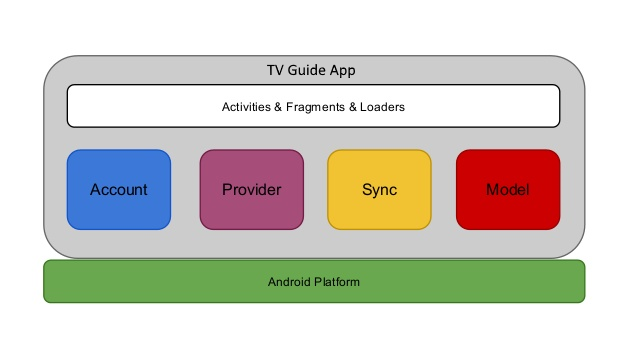
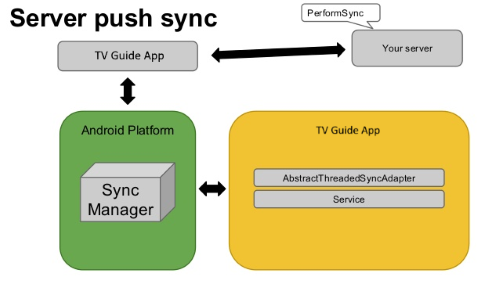
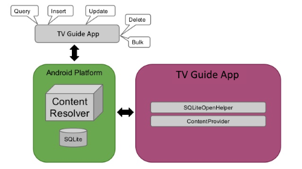
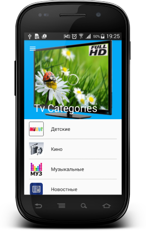
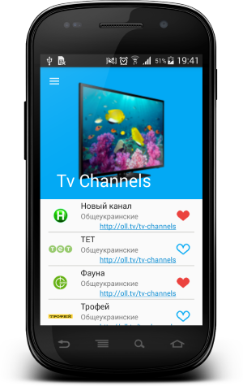

# TV Guide

  

Simple Android application for TV channels show programs.

All main and optional tasks fulfilled!

## Application concept:

### Account Manager manages user credentials

### Sync Manager keeps data up to date

### Content Provider stores structured data

### Loaders make data available

## Tv Guide App

Main Fragment|Categories Fragment | Channels Fragment/Preferred Fragment
-------------|----------------- | -------------
  |  | 

Preferred Fragment|Navigation Drawer|Settings Activity
-------------|-----------------|-------------
  |  | 

Sync|Date Picker|Sort Dialog
-------------|-----------------|-----------------
  | | 

#### Used libraries:

* com.android.support:appcompat-v7:25.1.1
* com.android.support:design:25.1.1
* com.android.support:support-v4:25.1.1
* com.android.support:recyclerview-v7:25.1.1
* com.squareup.picasso:picasso:2.5.2
* com.squareup.retrofit2:retrofit:2.1.0
* com.squareup.retrofit2:converter-gson:2.1.0
* com.squareup.okhttp3:logging-interceptor:3.3.1
* com.wdullaer:materialdatetimepicker:3.1.2
* com.rom4ek:arcnavigationview:1.0.2

Developed By
-------
Igor Havrylyuk (Graviton57)

[1]: https://github.com/graviton57/TvGuide.git
